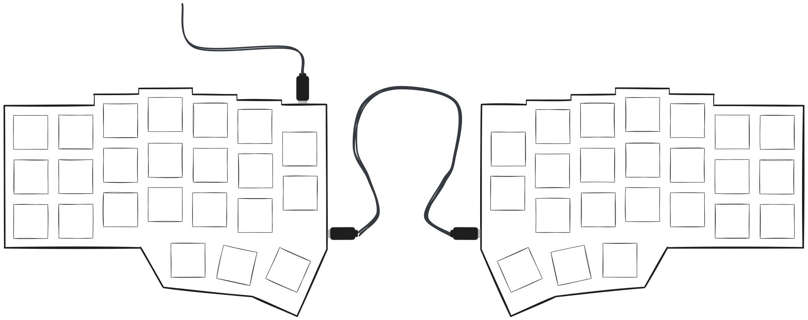

# 📘 Benutzerhandbuch: Zero Split Ergonomic Keyboard von Onspry

Willkommen zu Ihrer neuen **Zero Split Ergonomic Keyboard** von **Onspry**. Diese Anleitung hilft Ihnen, Ihre Tastatur schnell einzurichten und eventuelle Probleme zu beheben.

---

## 📦 Lieferumfang

- 1× Linke Tastaturhälfte (mit USB-C-Anschluss zum PC)
- 1× Rechte Tastaturhälfte
- 1× USB-C-zu-USB-C-Kabel (1 Meter) zum Anschluss an Ihren PC
- 1× USB-C-zu-USB-C-Verbindungskabel (25 cm) zum Verbinden beider Hälften

---

## 🔌 Erste Schritte

### Schritt 1: Verbinden Sie die beiden Hälften

Verwenden Sie das **mitgelieferte 25 cm USB-C-Kabel**, um die **linke** und **rechte** Hälfte der Tastatur zu verbinden.

- Stecken Sie ein Ende des Kabels in den **USB-C-Anschluss der linken Hälfte**.
- Stecken Sie das andere Ende in den **USB-C-Anschluss der rechten Hälfte**.

> 💡 _Tipp: Das Verbindungskabel ist beidseitig verwendbar – es gibt keinen speziellen „In“- oder „Out“-Port auf einer Seite._

### Schritt 2: Anschluss an Ihren Computer

Verwenden Sie das **1 Meter USB-C-zu-USB-C-Kabel**, um die **linke Hälfte** mit dem **USB-C-Anschluss Ihres Computers** zu verbinden.

- Stecken Sie ein Ende in den **USB-C-Anschluss der linken Hälfte**.
- Stecken Sie das andere Ende in Ihren **Computer**.

> 🔌 _Nur die linke Hälfte muss mit dem Computer verbunden werden. Die rechte Hälfte erhält Strom und Daten über das Verbindungskabel._

---

## ✅ Sie sind bereit zum Tippen!

Ihr Betriebssystem sollte die Tastatur automatisch erkennen. Für die Grundfunktionen sind keine zusätzlichen Treiber erforderlich.

---

## 🛠️ Fehlerbehebung

| Problem                       | Lösung                                                              |
| ----------------------------- | ------------------------------------------------------------------- |
| Nur eine Hälfte reagiert      | Stellen Sie sicher, dass das Verbindungskabel fest sitzt.           |
| Tastatur wird nicht erkannt   | Versuchen Sie einen anderen USB-C-Port oder ein anderes Kabel.      |
| Verzögerte oder keine Eingabe | Überprüfen Sie alle Kabelverbindungen und starten Sie Ihren PC neu. |

---

## 🔧 Firmware-Updates & Tastaturbelegung anpassen

Die Zero-Tastatur unterstützt erweiterte Anpassungen über **QMK** oder **VIA**.

- Passen Sie Tastenbelegungen, Ebenen und Makros an.
- Laden Sie Firmware oder Konfigurationstools herunter unter: [onspry.com/firmware](https://onspry.com/firmware)

> ⚠️ _Das Ändern der Firmware ist optional und für fortgeschrittene Nutzer gedacht._

---

## 🧰 Support

Brauchen Sie Hilfe oder haben Sie eine Frage?

- Besuchen Sie: **[onspry.com/support](https://onspry.com/support)**
- E-Mail: **[support@onspry.com](mailto:support@onspry.com)**

Wir helfen Ihnen gerne weiter.

---

## 📝 Abschließende Tipps

- Halten Sie die Kabel ordentlich, um Verschleiß oder versehentliches Abziehen zu vermeiden.
- Vermeiden Sie das Ein- oder Ausstecken des Verbindungskabels während des Tippens.
- Für mehr Komfort nutzen Sie eine Handballenauflage oder Zubehör zum Anwinkeln der Tastatur.

---

Danke, dass Sie sich für die **Zero Keyboard** von **Onspry** entschieden haben – wo Komfort auf Präzision trifft.

**Viel Spaß beim Tippen!**
