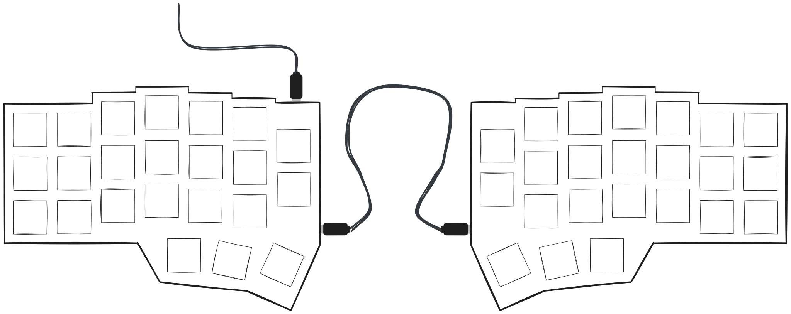
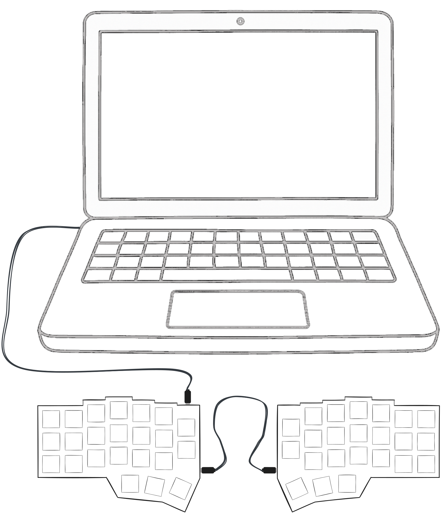

# 📘 Manuel d'utilisation : Clavier ergonomique Zero Split par Onspry

Bienvenue dans votre nouveau **clavier ergonomique Zero Split** de **Onspry**. Ce guide vous aidera à configurer rapidement votre clavier et à résoudre tout problème éventuel.

---

## 📦 Contenu de la boîte

- 1× Moitié gauche du clavier (avec connexion USB-C vers PC)
- 1× Moitié droite du clavier
- 1× Câble USB-C vers USB-C (1 mètre) pour connecter à votre PC
- 1× Câble d'interconnexion USB-C vers USB-C (25 cm) pour relier les deux moitiés

---

## 🔌 Mise en route

### Étape 1 : Connecter les deux moitiés

Utilisez le **câble USB-C de 25 cm fourni** pour connecter les moitiés **gauche** et **droite** du clavier.

- Branchez une extrémité du câble sur le **port USB-C de la moitié gauche**.
- Branchez l'autre extrémité sur le **port USB-C de la moitié droite**.

> 💡 _Astuce : le câble d'interconnexion est réversible — il n'y a pas de port « entrée » ou « sortie » dédié de chaque côté._

### Étape 2 : Connecter à votre ordinateur

Utilisez le **câble USB-C vers USB-C de 1 mètre** pour connecter la **moitié gauche** au **port USB-C de votre ordinateur**.

- Branchez une extrémité sur le **port USB-C de la moitié gauche**.
- Branchez l'autre extrémité sur votre **ordinateur**.

> 🔌 _Seule la moitié gauche doit être connectée à l'ordinateur. La moitié droite reçoit l'alimentation et les données via le câble d'interconnexion._

---

## ✅ Prêt à taper !

Votre système d'exploitation devrait reconnaître automatiquement le clavier. Aucun pilote supplémentaire n'est nécessaire pour les fonctions de base.

---

## 🛠️ Dépannage

| Problème                        | Solution                                                         |
| ------------------------------- | ---------------------------------------------------------------- |
| Seule une moitié répond         | Vérifiez que le câble d'interconnexion est bien branché.         |
| Clavier non détecté             | Essayez un autre port USB-C ou un autre câble.                   |
| Touches lentes ou non réactives | Vérifiez toutes les connexions de câbles et redémarrez votre PC. |

---

## 🔧 Mises à jour du firmware & personnalisation du keymap

Le clavier Zero prend en charge la personnalisation avancée via **QMK** ou **VIA**.

- Personnalisez les mappages de touches, les couches et les macros.
- Téléchargez le firmware ou les outils de configuration sur : [onspry.com/firmware](https://onspry.com/firmware)

> ⚠️ _La modification du firmware est optionnelle et réservée aux utilisateurs avancés._

---

## 🧰 Support

Besoin d'aide ou une question ?

- Visitez : **[onspry.com/support](https://onspry.com/support)**
- Email : **[support@onspry.com](mailto:support@onspry.com)**

Nous sommes là pour vous accompagner à chaque étape.

---

## 📝 Conseils finaux

- Gardez les câbles bien rangés pour éviter l'usure ou les déconnexions accidentelles.
- Évitez de brancher ou de débrancher le câble d'interconnexion pendant la frappe.
- Pour plus de confort, utilisez un repose-poignets ou des accessoires d'inclinaison pour clavier séparé.

---

Merci d'avoir choisi le **Zero Keyboard** de **Onspry** — où le confort rencontre la précision.

**Bonne frappe !**
